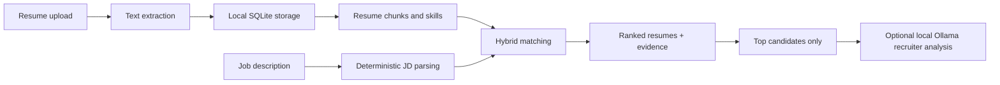

# AI Resume Matcher

> A privacy-first, local resume-to-job-description matcher that ranks your resumes with evidence — no required cloud AI.


**Quick links:** [Install](#installation) · [Run locally](#running-locally) · [Privacy](#privacy--local-first-design) · [API](#api-overview) · [Docs](docs/)

AI Resume Matcher helps answer one practical question: **which resume should I use for this job?** Upload PDF, DOCX, or TXT resumes once, paste a job description, and get a ranked recommendation with requirement evidence, heuristic ATS checks, and optional local Ollama recruiter-style analysis.

## Overview

AI Resume Matcher is a local-first web application for people who maintain multiple resume variants. It combines deterministic skill extraction, local embeddings, SQLite persistence, and optional Ollama analysis to rank stored resumes against a job description.

The app is designed for job seekers, developers, students, and anyone who wants resume matching without sending private documents to a hosted AI service.

## Why AI Resume Matcher?

| Problem | Approach |
| --- | --- |
| Resumes contain personal data | Files, extracted text, history, and indexes stay in local storage. |
| Cloud AI tools can be opaque | Core scoring is deterministic and evidence-based. |
| Matching should be explainable | Requirements are marked `STRONG`, `PARTIAL`, or `MISSING` with resume evidence when available. |
| Local apps should be practical | Includes FastAPI, Next.js, SQLite, tests, and macOS launcher scripts. |

## Key Features

- Upload and manage PDF, DOCX, and TXT resumes.
- Extract resume text locally with PyMuPDF and python-docx.
- Store metadata, text, history, chunks, skills, and analysis results in SQLite.
- Prevent duplicate uploads using SHA-256 file hashes.
- Parse job descriptions into required skills, preferred skills, technologies, responsibilities, education, and experience requirements.
- Rank all stored resumes with weighted hybrid matching.
- Show evidence for requirement matches and avoid unsupported claims.
- Estimate ATS compatibility using measurable formatting/content checks.
- Cache analyses by resume hash, job description hash, and matching configuration.
- Optionally call local Ollama for recruiter-style assessment of top candidates only.
- Run fully without OpenAI, Anthropic, Gemini, API keys, or cloud services.

## How It Works



## Architecture

| Layer | Technology | Responsibility |
| --- | --- | --- |
| Frontend | Next.js, React, TypeScript, Tailwind CSS | Resume library, analysis workflow, history, settings, comparison UI |
| Backend | FastAPI | Uploads, extraction, indexing, scoring, API, Ollama provider |
| Storage | SQLite + local filesystem | Resume records, uploaded files, chunks, skills, analysis history, cache |
| Parsing | PyMuPDF, python-docx | Local PDF and DOCX text extraction |
| Matching | Deterministic extraction + local embeddings | Ranking, evidence, ATS estimate |
| Optional AI | Ollama | Local recruiter-style assessment for top candidates |

More detail: [docs/architecture.md](docs/architecture.md).

## Matching Pipeline

Default score weights:

| Signal | Weight |
| --- | ---: |
| Required skills | 35% |
| Preferred skills | 20% |
| Semantic similarity | 15% |
| Experience match | 10% |
| Responsibilities match | 10% |
| Education match | 5% |
| Estimated ATS compatibility | 5% |

Scores are heuristic match signals, not hiring probabilities. See [docs/matching-engine.md](docs/matching-engine.md).

## Recruiter Analysis

Ollama is optional. When configured, AI Resume Matcher sends only the job description, structured requirements, deterministic match results, resume evidence, and top candidate resume content to a local Ollama model. The app is designed to keep deterministic ranking available even if Ollama is unavailable.

Default local model: `mistral:latest`.

See [docs/recruiter-analysis.md](docs/recruiter-analysis.md) and [docs/ollama.md](docs/ollama.md).

## Privacy & Local-First Design

Your resumes, uploaded files, extracted text, embeddings, analysis history, settings, and SQLite database are stored locally in the project folder by default. The application does not require any paid or hosted AI API.

The public repository intentionally ignores generated local data. See [docs/privacy.md](docs/privacy.md) and [docs/data-storage.md](docs/data-storage.md).

## Screenshots / Demo

Screenshots are not included yet because the current local app contains personal resume data. Safe demo screenshots should be captured with synthetic resumes only and placed in `docs/images/`.

## Requirements

- macOS, Linux, or Windows for development
- Python 3.9+
- Node.js 20+
- npm
- Optional: Ollama for local recruiter-style analysis

## Installation

```bash
git clone git@github.com:NagaSekhar23/ai-resume-matcher.git
cd ai-resume-matcher
python3 -m venv .venv
source .venv/bin/activate
python -m pip install --upgrade pip
pip install -r requirements.txt
cp .env.example .env
cd frontend
npm ci
cp .env.example .env.local
```

If you use HTTPS instead of SSH:

```bash
git clone https://github.com/NagaSekhar23/ai-resume-matcher.git
```

## Ollama Setup

Ollama is optional for the AI-assisted recruiter section. Deterministic matching still works without it.

```bash
ollama pull mistral:latest
ollama serve
curl http://localhost:11434/api/tags
```

Default configuration:

```text
OLLAMA_BASE_URL=http://localhost:11434
OLLAMA_MODEL=mistral:latest
```

See [docs/ollama.md](docs/ollama.md).

## Running Locally

Terminal 1 — backend:

```bash
source .venv/bin/activate
python -m uvicorn backend.app.main:app --reload --host 127.0.0.1 --port 8000
```

Terminal 2 — frontend:

```bash
cd frontend
npm run dev -- --hostname 127.0.0.1 --port 3000
```

Open `http://127.0.0.1:3000/`.

## Using the Application

1. Upload resumes in PDF, DOCX, or TXT format.
2. Confirm extracted text is readable.
3. Paste a job description on the Analyze page.
4. Review the best resume, ranking, score breakdown, and evidence matrix.
5. Optionally run recruiter-style analysis with local Ollama.
6. Reopen previous analyses from History.

## Resume Management

The app stores uploaded files by SHA-256 hash, detects duplicates, supports replacement, deletes uploaded files when a resume is removed, and reuses indexes for unchanged resumes.

## Configuration

Root `.env` values:

| Variable | Default | Purpose |
| --- | --- | --- |
| `DATABASE_PATH` | `./data/db/resumes.sqlite3` | SQLite database path |
| `UPLOAD_DIR` | `./data/uploads` | Local uploaded resume storage |
| `CORS_ORIGINS` | `http://localhost:3000,http://127.0.0.1:3000` | Allowed local frontend origins |
| `MAX_UPLOAD_BYTES` | `10485760` | Upload size limit |
| `USE_SENTENCE_TRANSFORMERS` | `0` | Use sentence-transformers if available locally |
| `OLLAMA_BASE_URL` | `http://localhost:11434` | Local Ollama server URL |
| `OLLAMA_MODEL` | `mistral:latest` | Local Ollama model |

Frontend `.env.local`:

```text
NEXT_PUBLIC_API_BASE_URL=http://localhost:8000
```

See [docs/configuration.md](docs/configuration.md).

## API Overview

| Method | Endpoint | Purpose |
| --- | --- | --- |
| `GET` | `/api/health` | Backend health check |
| `POST` | `/api/resumes` | Upload a resume |
| `GET` | `/api/resumes` | List resumes |
| `GET` | `/api/resumes/{id}` | Fetch a resume |
| `PUT` | `/api/resumes/{id}` | Replace a resume |
| `DELETE` | `/api/resumes/{id}` | Delete a resume |
| `POST` | `/api/resumes/{id}/index` | Index or re-index a resume |
| `POST` | `/api/jobs/analyze` | Analyze a JD against all resumes |
| `GET` | `/api/analyses/{id}` | Fetch prior analysis |
| `POST` | `/api/analyses/{id}/recruiter` | Run optional local recruiter analysis |
| `POST` | `/api/analyses/{id}/compare` | Compare selected resumes |
| `GET` | `/api/history` | List analysis history |
| `DELETE` | `/api/history/{id}` | Delete analysis history entry |
| `GET` | `/api/settings` | Read settings |
| `PUT` | `/api/settings` | Update settings |
| `GET` | `/api/llm/status` | Check local LLM status |

Full details: [docs/api.md](docs/api.md).

## Project Structure

```text
ai-resume-matcher/
├── backend/              FastAPI application
├── frontend/             Next.js application
├── tests/                Backend tests
├── docs/                 Project documentation
├── scripts/              Local/macOS launcher scripts
├── launchers/            Double-clickable macOS command launchers
├── data/                 Runtime data directories; contents ignored
├── .github/              Issue templates, PR template, CI
├── .env.example          Backend environment template
├── requirements.txt      Python dependencies
└── README.md
```

## Testing

```bash
source .venv/bin/activate
USE_SENTENCE_TRANSFORMERS=0 python -m pytest -q
cd frontend
npm test
npm run lint
npm run typecheck
npm run build
```

CI runs the same backend/frontend checks without requiring Ollama.

## Development

- Keep matching behavior evidence-based.
- Treat uploaded resume text as untrusted input.
- Do not commit local data from `data/`, `logs/`, `.env`, `.venv`, `.next`, or `node_modules`.
- Prefer focused changes with tests for parsing, scoring, API behavior, and UI states.

See [docs/development.md](docs/development.md).

## Troubleshooting

| Symptom | Check |
| --- | --- |
| Frontend connection refused | Confirm `npm run dev -- --hostname 127.0.0.1 --port 3000` is running. |
| Backend unavailable | Confirm `python -m uvicorn backend.app.main:app --reload --host 127.0.0.1 --port 8000`. |
| Duplicate upload | The same file hash already exists. |
| Scanned PDF extracts little text | OCR is not implemented. Use text-based PDFs, DOCX, or TXT. |
| Ollama unavailable | Deterministic matching still works; check `ollama serve` and `ollama pull mistral:latest`. |

More help: [docs/troubleshooting.md](docs/troubleshooting.md).

## Performance / Caching

Resumes are indexed once and reused when the file hash is unchanged. Analysis results are cached by resume hash, job description hash, and matching configuration. Ollama is called only for top candidates when recruiter analysis is requested.

## Limitations

- ATS compatibility is a heuristic estimate, not a vendor ATS score.
- Recruiter analysis is local-AI-assisted and may be unavailable if Ollama is not running.
- OCR for scanned PDFs is not included.
- Matching quality depends on extractable resume text and explicit JD requirements.

## Security

- Uploaded files are validated by type and size.
- Stored filenames are hash-based rather than user-controlled.
- Resume text is rendered as untrusted text, not executable content.
- Local `.env`, databases, uploads, logs, caches, virtual environments, and build outputs are ignored by Git.

Report vulnerabilities using [SECURITY.md](SECURITY.md).

## Contributing

Contributions are welcome. Please read [CONTRIBUTING.md](CONTRIBUTING.md), open an issue for larger changes, and include tests for behavior changes.

## Roadmap

- Safer synthetic demo dataset and screenshots.
- More configurable local embedding providers.
- Import/export tools for local backups.
- Packaging improvements for desktop-like installation.
- More granular requirement editing before analysis.

## License

MIT License. See [LICENSE](LICENSE).

## Acknowledgements

Built with FastAPI, Next.js, SQLite, PyMuPDF, python-docx, NumPy, sentence-transformers, and Ollama.
