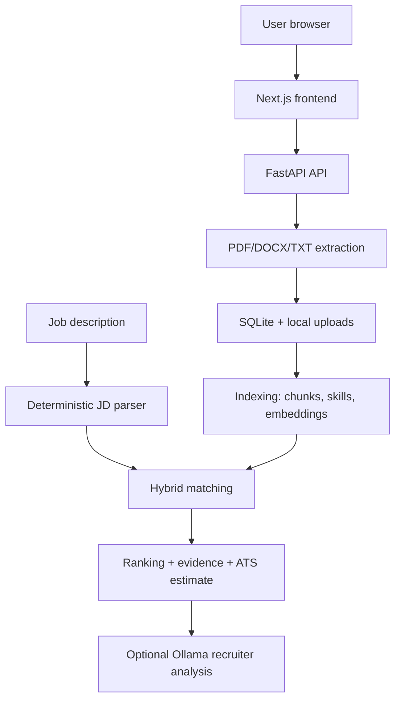

# Architecture

AI Resume Matcher is a local-first web application with a FastAPI backend, Next.js frontend, SQLite database, and filesystem upload storage.

## Components

- `frontend/`: single-page Next.js app with resume management, analysis, history, settings, and comparison UI.
- `backend/app/main.py`: FastAPI routes and request orchestration.
- `backend/app/extraction.py`: local PDF, DOCX, and TXT text extraction.
- `backend/app/database.py`: SQLite schema creation and persistence helpers.
- `backend/app/indexing.py`: resume section chunking, skill storage, and embedding reuse.
- `backend/app/matching.py`: job analysis, scoring, ranking, cache lookup, and cache writes.
- `backend/app/llm.py`: provider abstraction and Ollama implementation.
- `scripts/` and `launchers/`: optional macOS startup helpers.

## Deterministic vs. LLM behavior

Deterministic code handles uploads, extraction, indexing, JD parsing, requirement matching, ranking, evidence selection, ATS estimation, comparison, settings, and history. Ollama is optional and used only for recruiter-style assessment after deterministic ranking exists.
